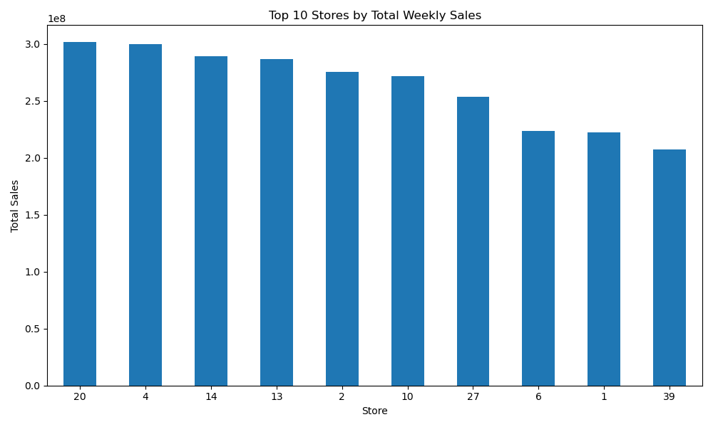
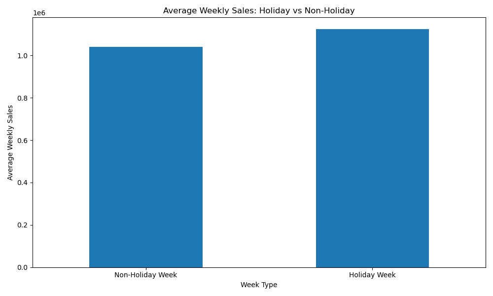

# A Python-Based Analysis of Walmart Weekly Sales: Store Performance, Holiday Effects, and Economic Factors

This GitHub data analysis project examines Walmart weekly sales data to compare store performance, identify time trends, evaluate holiday effects, and explore selected economic factors.

## 1. Problem and Intended User
This project analyses Walmart weekly sales data to understand how store differences, holiday periods, and selected economic factors affect sales performance.

The intended users are retail managers, beginner business analysts, and students interested in retail data analysis.

## 2. Data
Dataset: Walmart Sales Dataset  
Original source: Kaggle, Walmart Sales Forecast Dataset  
Source link: https://www.kaggle.com/datasets/mikhail1681/walmart-sales
Access date: 21 April 2026

Variables used:
- Store
- Date
- Weekly_Sales
- Holiday_Flag
- Temperature
- Fuel_Price
- CPI
- Unemployment

## 3. Methods
This project uses Python for:
- data loading
- data cleaning
- datetime conversion
- descriptive statistics
- grouping and aggregation
- visualisation
- simple relationship analysis using correlation and scatter plots

## 4. Key Findings
- Sales performance varied substantially across stores.
- Weekly sales changed over time, suggesting seasonal or period effects.
- Holiday weeks showed different average sales from non-holiday weeks.
- Economic indicators had limited or mixed relationships with weekly sales.
- Store-level planning and timing appear important for retail decision-making.

## 5. Repository Structure
- notebook.ipynb: main analysis notebook
- data/Walmart_Sales.csv: dataset
- figures/: exported figures
- requirements.txt: required Python packages

## 6. How to Run
1. Download or clone this repository.
2. Install the required packages:
   pip install -r requirements.txt
3. Open notebook.ipynb in Jupyter Notebook.
4. Run all cells from top to bottom.

## 7. Sample Outputs

### Top 10 Stores by Total Sales

### Holiday vs Non-Holiday Weekly Sales

## 8. Demo Video
The demo video link will be added before final submission.

## 9. Limitations and Next Steps
This project is limited by the variables available in the dataset. Future work could include forecasting, store clustering, or additional retail variables such as promotions, product categories, and regional information.